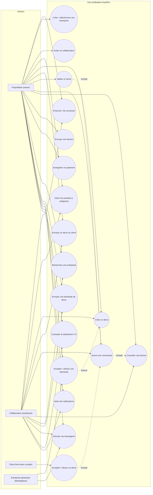
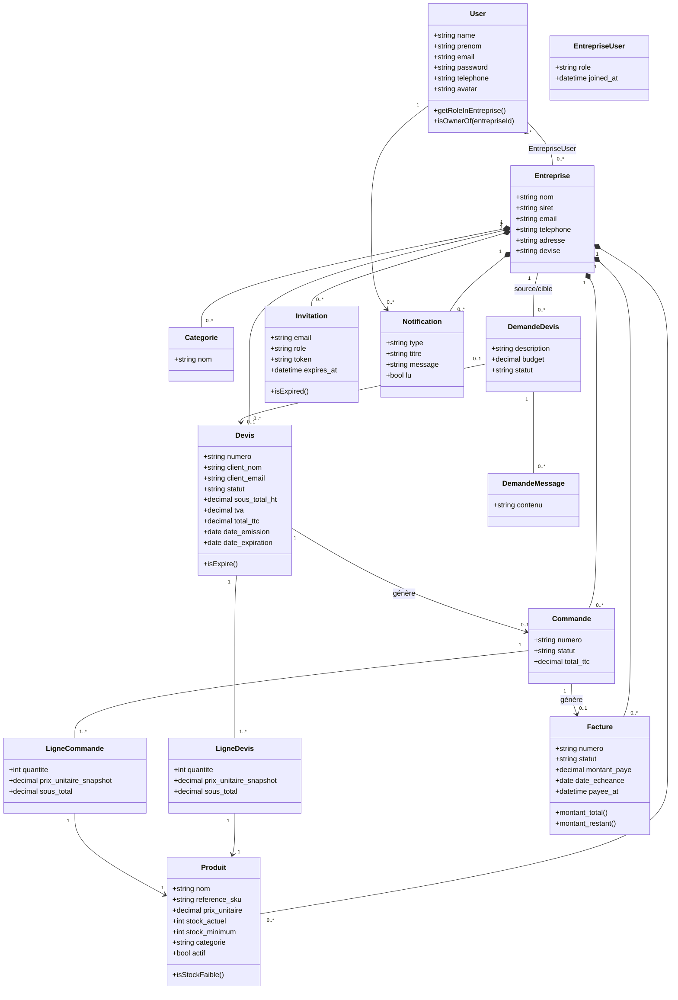
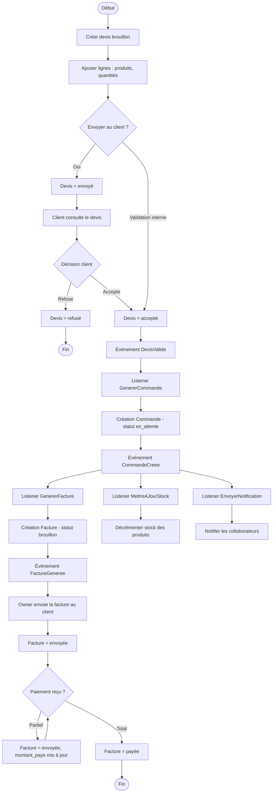
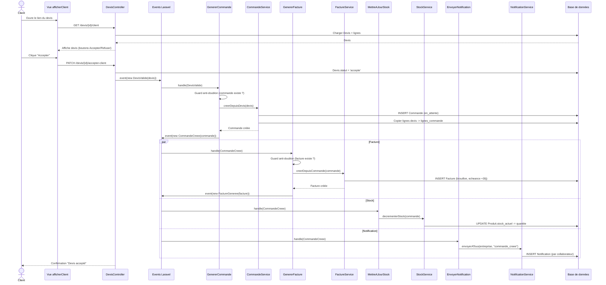
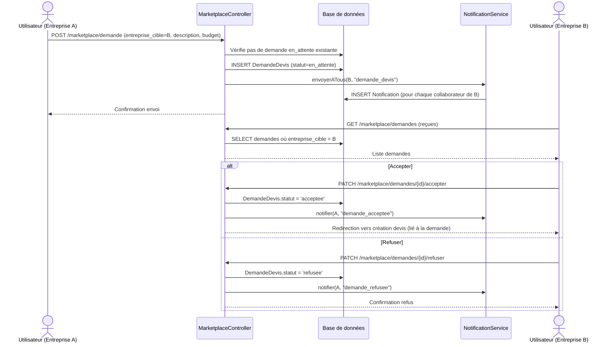

# GestiPro — Récapitulatif fonctionnel & Diagrammes UML

## 1. Que fait l'application ?

GestiPro est une application web **B2B multi-tenant** de gestion commerciale, avec un
microservice IA (FastAPI) en complément. Une "entreprise" est l'unité de travail : chaque
utilisateur peut appartenir à plusieurs entreprises, avec un rôle **owner** (propriétaire) ou
**employee** (collaborateur).

### Fonctionnalités principales

- **Authentification & multi-entreprise** : inscription, connexion, sélection/création
  d'entreprise, invitation de collaborateurs par email (token expirable 7 jours).
- **Catalogue produits** : produits classés par catégorie, gestion du stock (stock actuel /
  seuil minimum), prix unitaire.
- **Devis** : création, édition (tant que brouillon), envoi au client par email, le client
  accepte/refuse depuis un lien public, validation manuelle possible côté entreprise.
- **Commandes** : générées **automatiquement** dès qu'un devis est accepté ; suivi de statut
  (en attente → en cours → livrée / annulée).
- **Factures** : générées **automatiquement** dès qu'une commande est créée ; envoi au client,
  enregistrement de paiements (y compris partiels), téléchargement PDF (y compris via lien
  public signé).
- **Marketplace B2B** : une entreprise peut rechercher une autre entreprise et lui envoyer une
  **demande de devis**, échanger des messages, puis l'entreprise cible accepte (→ crée un
  devis) ou refuse.
- **Notifications** internes (in-app) pour tous les événements clés (commande créée, demande
  reçue/acceptée/refusée, message reçu, etc.).
- **Dashboard** : KPI (CA du mois, devis en attente, commandes en cours, factures impayées),
  graphique 6 mois, suggestions IA.
- **Module IA** : alertes de stock faible, prévisions de vente, top produits, recommandations
  (microservice FastAPI, avec fallback local si indisponible).

### Automatisation centrale (le cœur métier)

Le système repose sur une **chaîne d'événements Laravel** qui automatise tout le flux
commercial dès qu'un devis est accepté :

```
Devis accepté (DevisValide)
   → Commande créée automatiquement (CommandeCreee)
        → Facture générée automatiquement (FactureGeneree)
        → Stock décrémenté
        → Notification envoyée à l'équipe
```

---

## 2. Diagramme de cas d'utilisation



---

## 3. Diagramme de classes (simplifié)



---

## 4. Diagramme d'activité — flux Devis → Commande → Facture



---

## 5. Diagramme de séquence — Acceptation d'un devis par le client



---

## 6. Diagramme de séquence — Demande de devis Marketplace B2B


